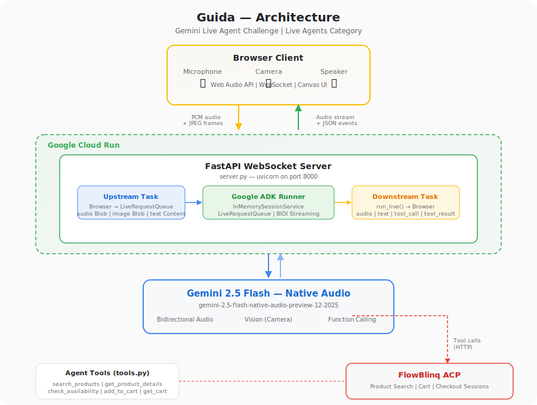

# Guida — AI Shopping Grandmother

A voice-first AI shopping agent that helps parents navigate baby food introduction. Talk to Guida naturally — she sees your kitchen through the camera, recommends age-appropriate products, and adds them to your cart in real time.

**Category**: Live Agents | **Hackathon**: Gemini Live Agent Challenge

## Demo

> _4-minute demo video link here_

## Architecture



```
Browser (Mic + Camera)
    │
    │  WebSocket (binary PCM audio + JSON)
    │
    ▼
┌──────────────────────────────────────────┐
│  FastAPI Server (Cloud Run)              │
│                                          │
│  ┌─────────────┐    ┌─────────────────┐  │
│  │  Upstream    │    │  Downstream     │  │
│  │  (Browser →  │    │  (ADK →         │  │
│  │   ADK)       │    │   Browser)      │  │
│  └──────┬───────┘    └───────▲─────────┘  │
│         │                    │             │
│         ▼                    │             │
│  ┌──────────────────────────────────────┐ │
│  │  Google ADK Runner                   │ │
│  │  LiveRequestQueue + RunConfig(BIDI)  │ │
│  │  StreamingMode.BIDI                  │ │
│  └──────────────┬───────────────────────┘ │
│                 │                          │
└─────────────────┼──────────────────────────┘
                  │
                  ▼
┌──────────────────────────────────────────┐
│  Gemini 2.5 Flash (Native Audio)        │
│  gemini-2.5-flash-native-audio-preview  │
│                                          │
│  - Bidirectional audio streaming         │
│  - Input/output transcription            │
│  - Vision (camera frames)                │
│  - Function calling (5 tools)            │
└──────────────┬───────────────────────────┘
               │
               │  Tool calls (HTTP)
               ▼
┌──────────────────────────────────────────┐
│  FlowBlinq ACP (Commerce API)           │
│  dev-brands-api.flowblinq.com            │
│                                          │
│  /acp/brands/{id}/feed        → search   │
│  /acp/brands/{id}/feed/{pid}  → details  │
│  /checkout/brands/{id}/sessions → cart   │
└──────────────────────────────────────────┘
```

### Data Flow

1. **User speaks** into mic — browser captures 16kHz PCM audio, sends as binary over WebSocket
2. **User shows camera** — browser captures JPEG frames, sends as base64 JSON over WebSocket
3. **FastAPI upstream** routes audio/image/text to ADK `LiveRequestQueue`
4. **ADK Runner** streams to Gemini via `run_live()` in BIDI mode
5. **Gemini** processes speech + vision, decides to call tools or respond with audio
6. **Tool calls** hit FlowBlinq ACP endpoints (product search, cart management)
7. **Audio response** streams back through ADK → WebSocket → browser speaker
8. **UI updates** — product cards, cart state, and transcriptions render in real time

## Tech Stack

| Layer | Technology |
|-------|-----------|
| Model | Gemini 2.5 Flash (native audio preview) |
| Agent Framework | Google ADK 1.2+ (`Runner`, `LiveRequestQueue`, `RunConfig`) |
| SDK | Google GenAI SDK 1.0+ |
| Backend | FastAPI + uvicorn (WebSocket server) |
| Frontend | Vanilla JS + Web Audio API + WebSocket |
| Commerce | FlowBlinq ACP (Agent Commerce Protocol) |
| Deployment | Google Cloud Run (Docker) |
| Image Generation | Gemini 2.0 Flash (avatar generation) |

## Features

- **Real-time voice conversation** — talk naturally, interrupt anytime (Gemini handles turn-taking)
- **Camera vision** — show your pantry/kitchen, Guida identifies what you have and what's missing
- **Live product search** — searches FlowBlinq catalog based on baby's age and needs
- **Add to cart by voice** — "add that to my cart" triggers actual checkout session creation
- **Audio + text transcription** — see what was said in the chat sidebar
- **Interruption handling** — Gemini detects when you start talking and stops its response

## Prerequisites

- Python 3.12+
- A [Google AI API key](https://aistudio.google.com/apikey) with Gemini access
- (Optional) A FlowBlinq brand ID for live commerce — works with demo data without one

## Local Setup

```bash
# 1. Clone the repo
git clone https://github.com/<your-username>/guida-gemini-challenge.git
cd guida-gemini-challenge

# 2. Create virtual environment
python -m venv .venv
source .venv/bin/activate  # Windows: .venv\Scripts\activate

# 3. Install dependencies
pip install -r requirements.txt

# 4. Configure environment
cp .env.example .env
# Edit .env — add your GOOGLE_API_KEY (required)
# FLOWBLINQ_API_URL and FLOWBLINQ_BRAND_ID are optional (demo data available)

# 5. Run the server
python server.py
# or: uvicorn server:app --host 0.0.0.0 --port 8000

# 6. Open http://localhost:8000 in Chrome
# Allow microphone + camera access when prompted
```

## Google Cloud Deployment

Guida deploys to **Cloud Run** via a single script.

### Prerequisites

- [Google Cloud CLI](https://cloud.google.com/sdk/docs/install) installed and authenticated
- A GCP project with Cloud Run and Container Registry APIs enabled

### Deploy

```bash
# Set your API key
export GOOGLE_API_KEY="your-gemini-api-key"

# Optional: FlowBlinq commerce integration
export FLOWBLINQ_API_URL="https://dev-brands-api.flowblinq.com"
export FLOWBLINQ_BRAND_ID="your-brand-uuid"

# Optional: override GCP project (defaults to guida-gemini-challenge)
export GCP_PROJECT_ID="your-project-id"

# Deploy
chmod +x deploy.sh
./deploy.sh
```

This will:
1. Build the Docker container via Cloud Build
2. Push to Google Container Registry
3. Deploy to Cloud Run (us-central1, 512Mi RAM, 1 CPU, max 3 instances)
4. Print the public URL

### Cloud Run Configuration

| Setting | Value |
|---------|-------|
| Region | us-central1 |
| Memory | 512Mi |
| CPU | 1 |
| Max instances | 3 |
| Auth | Unauthenticated (public) |
| Port | 8000 |

## Running Tests

```bash
# Start the server first
python server.py &

# WebSocket connectivity test
python test_ws.py

# WebSocket + audio streaming test
python test_ws_with_audio.py

# Full end-to-end test (greeting → search → tool calls → audio response)
python test_e2e.py
```

## Project Structure

```
guida-gemini-challenge/
├── server.py              # FastAPI WebSocket server — bridges browser ↔ ADK
├── agent.py               # Guida agent definition (system prompt, model, tools)
├── tools.py               # FlowBlinq ACP tool wrappers (FunctionTool)
├── requirements.txt       # Python dependencies
├── Dockerfile             # Container config (Python 3.12-slim)
├── deploy.sh              # Google Cloud Run deployment script
├── .env.example           # Environment variable template
├── generate_portrait.py   # One-off: generate Guida avatar with Gemini
├── test_e2e.py            # End-to-end test suite
├── test_ws.py             # WebSocket connectivity test
├── test_ws_with_audio.py  # Audio streaming test
├── architecture.svg       # Architecture diagram
└── static/
    ├── index.html         # Frontend UI
    ├── app.js             # Browser client (WebSocket, audio, camera, UI)
    ├── guida-avatar.png   # Generated avatar
    ├── guida-idle.mp4     # Avatar idle animation
    └── guida-speaking.mp4 # Avatar speaking animation
```

## How It Works

### Agent (agent.py)

Guida is defined as a Google ADK `Agent` with:
- **Model**: `gemini-2.5-flash-native-audio-preview-12-2025` — native audio I/O, no STT/TTS pipeline needed
- **System prompt**: Warm grandmother persona, shopping-first behavior, strict tool-calling rules
- **5 commerce tools**: `search_products`, `get_product_details`, `check_availability`, `add_to_cart`, `get_cart`

### Server (server.py)

FastAPI app with a WebSocket endpoint per session. Each connection spawns two async tasks:
- **Upstream**: Browser → ADK (audio as `Blob`, images as `Blob`, text as `Content`)
- **Downstream**: ADK `run_live()` → Browser (audio as binary, text/tools/transcriptions as JSON)

Uses ADK's `InMemorySessionService` for session state and `LiveRequestQueue` for bidirectional streaming.

### Commerce (tools.py)

All tools wrap FlowBlinq's ACP (Agent Commerce Protocol) REST API:
- Product search with natural language queries
- Real-time availability checks
- Cart/checkout session management
- No authentication required — public endpoints

## Learnings

1. **ADK's BIDI streaming is powerful but opaque** — debugging required extensive event logging to understand what Gemini was sending back (audio chunks, transcriptions, tool calls all interleaved)
2. **Native audio models eliminate latency** — no STT→LLM→TTS pipeline means sub-second response times
3. **Interruption handling is built-in** — Gemini detects when the user starts speaking and signals `interrupted`, letting the client flush audio gracefully
4. **Camera + voice creates natural shopping** — showing a pantry and talking about what's needed feels more natural than typing search queries
5. **Tool calling works seamlessly in audio mode** — Gemini calls functions mid-conversation without breaking the audio stream

## License

MIT
